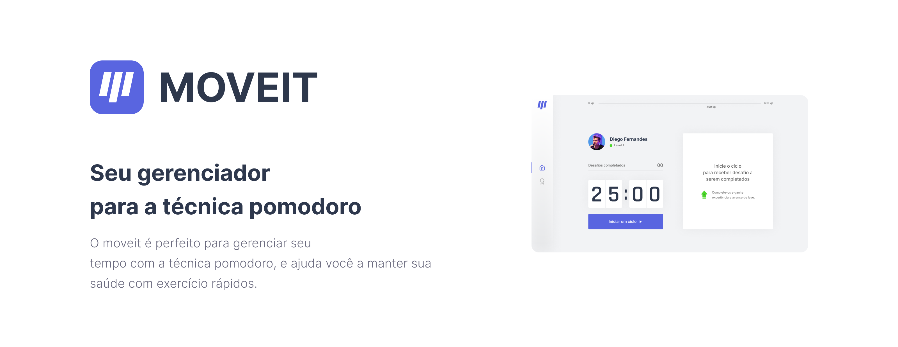

<h2 style="text-align:center;">
 🚧 React Select 🚀 Em construção... 🚧
</h2>

<h3 style="text-align:center;">


</h3>
<h1 style="display:flex; align-items:center;">
   <b style="margin-left: 4px;">Move.it</b>
</h1>

## **Sumário**

- [Sobre](#Sobre)
- [Como usar](#Como-usar)
  - [Pré-Requisitos](#pré-requisitos)
  - [Iniciar aplicação](#iniciar-aplicação)
- [Tecnologias Utilizadas](#tecnologias-utilizadas)
- [Autor](#autor)
- [Licença](#licença)

## **Sobre**

O Move.it veio para ajudar você a gerenciar seu tempo através da técnica promodoro, a cada 25 minutos ele te envia uma notificação avisando que está na hora de dar uma pausar e fazer um alongamento, com o objetivo de melhora sua saúde, tanto mental quanto física, e sua produtividade!

## **Como usar**

---

### **Pré-requisitos**

- git
- node.js 16.14.0 lts
- yarn ou npm

### **Instalação**

```bash
# Clone o repositório com este comando
$ git clone https://github.com/JaquesBoeno/moveit.git
```

### **Iniciar aplicação**

```bash
# Entre no diretório do projeto
$ cd moveit

# Instale as dependências
$ yarn install ou npm install

# Inicie a aplicação
$ yarn dev ou npm run dev

```

## **Tecnologias Utilizadas**

- <h3 style="display:flex; align-items:center;">
    
    <a style="margin-left: 4px;" href="https://reactjs.org/">React</a>
  </h3>

- <h3 style="display:flex; align-items:center;">
    
    <a style="margin-left: 4px;" href="https://reactjs.org/">Next.js</a>
  </h3>

- <h3 style="display:flex; align-items:center;">
    
    <a style="margin-left: 4px;" href="https://reactjs.org/">Typescript</a>
  </h3>

- <h3 style="display:flex; align-items:center;">
    
    <a style="margin-left: 4px;" href="https://reactjs.org/">sass</a>
  </h3>

## **Autor**

---

<br/>

  

feito com ❤️ por Jaques Boeno! 👋🏼 Entre em contato!

[](mailto:jaquesvagnerjunior@gmail.com)

# **Licença**

Leia o arquivo LICENSE.txt, na raiz do projeto
